# 3すくみ仮説に基づく魚種交代シミュレーション

Lotka-Volterra方程式の変形による魚種交代のシミュレーション及び、鯨類の摂餌行動による魚種の枯渇リスクへの影響評価

## Requirements

- Python >= 3.5.0

## 実験概要

3魚種間の競合関係をモデル化するため、まずはLotka-Volterra微分方程式の解軌道の一つとして使われる以下の式を考える。

現実的には、この3種の孤立系として考えるよりも、他種からの影響を受けない場所(繁殖海域付近など)が存在する。またヒゲクジラ類の摂餌を考慮したシミュレーションを行うため、以下の仮定のもと鯨類を当該モデルに組み込む。

- ヒゲクジラ類は魚種に対しての選り好みを行わず、各魚種の個体数に比例した割合で摂餌を行う
- 一般に、ヒゲクジラの個体数変動は食用魚種と比較して小さいため、無視できるものとする。

以上の仮定に基づき、他種の影響を受けない定常項と、ヒゲクジラ類の摂餌による変動項を設ける。

ただし、z(t)はホワイトノイズである。

この式を用いて、tを0から150まで変化させた時の各魚種の個体数の変化を計測した。
また、鯨類の摂餌行動による影響を見るため、w=0(摂餌なし)の場合とw=0.1, 0.2(摂餌あり)の3パターンに対して、30回ずつシミュレーションを行い、結果を比較した。

## 実験結果

### 魚種1

#### w=0
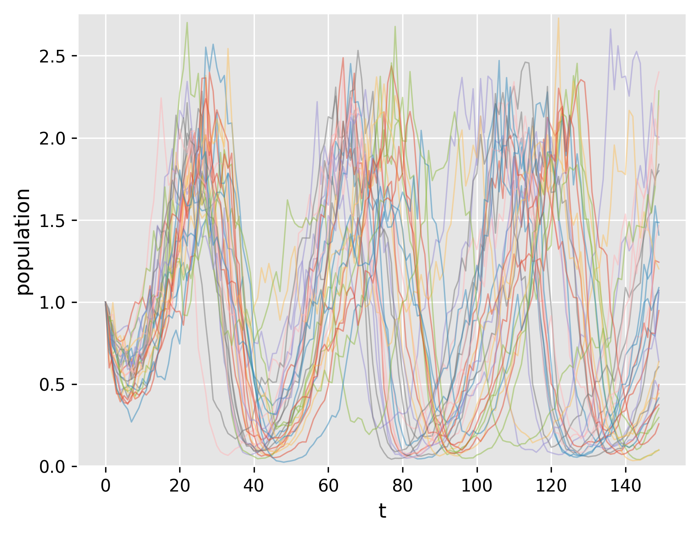

#### w=0.1
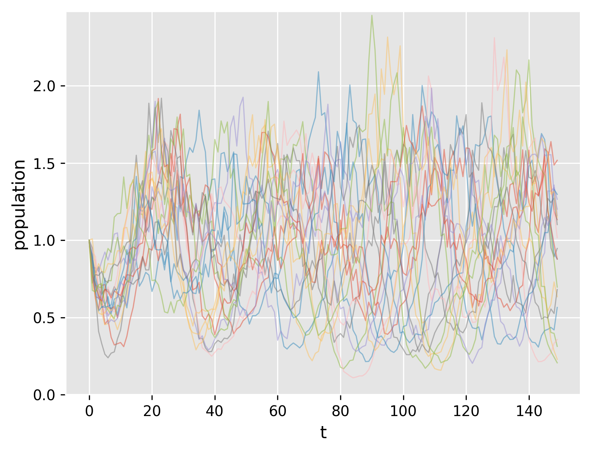

#### w=0.2
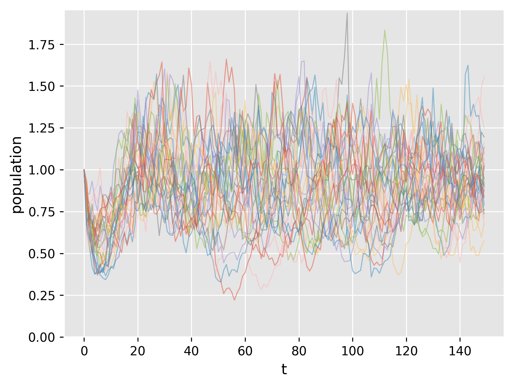

### 魚種2

#### w=0
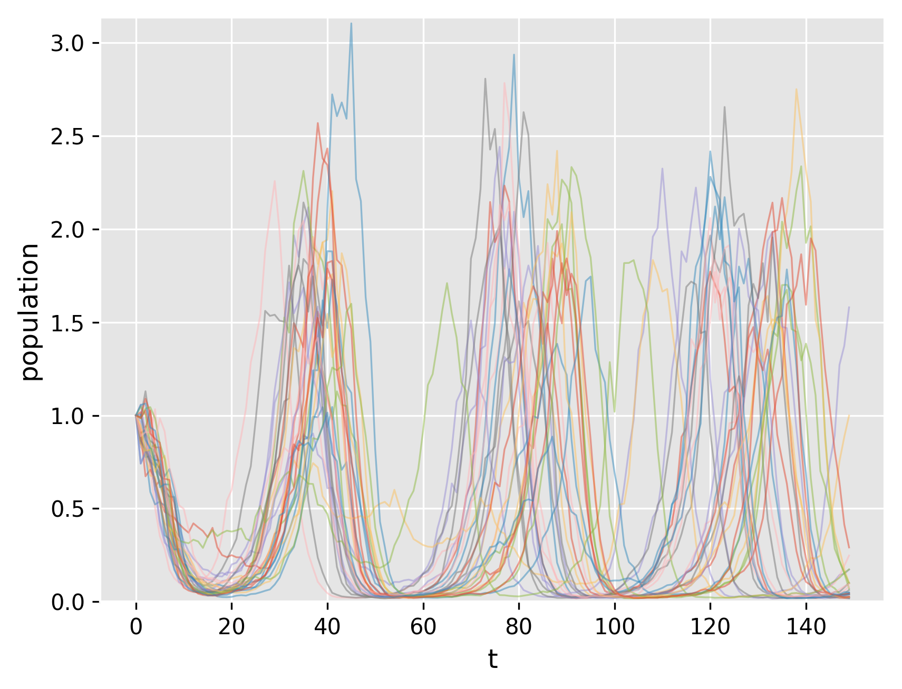

#### w=0.1
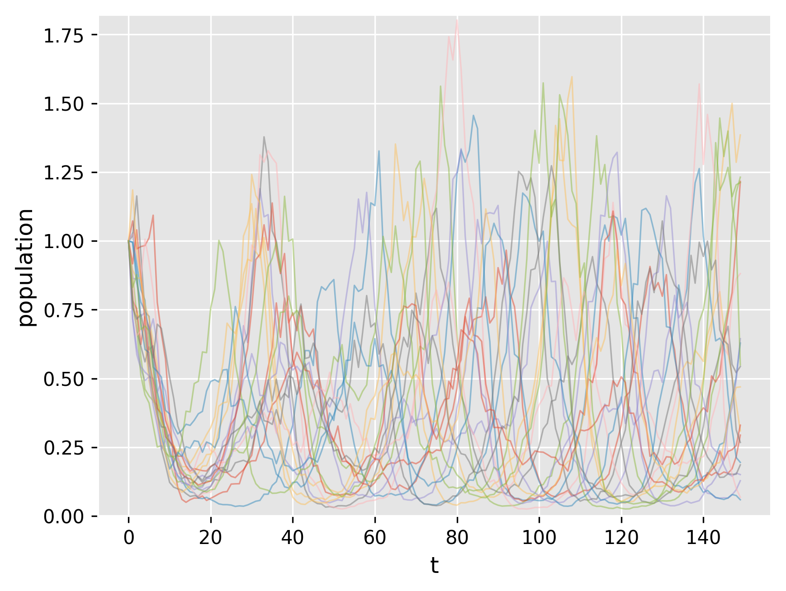

#### w=0.2
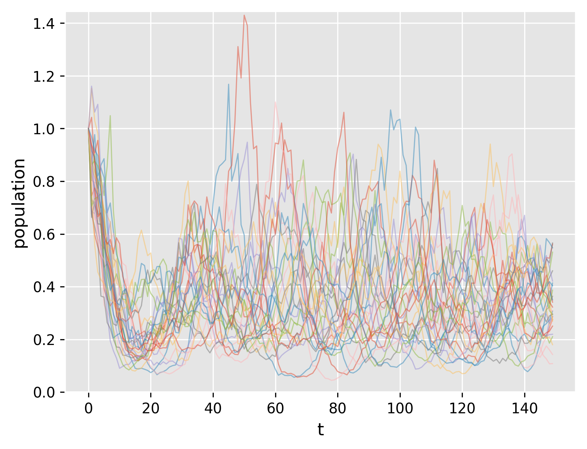

### 魚種3

#### w=0
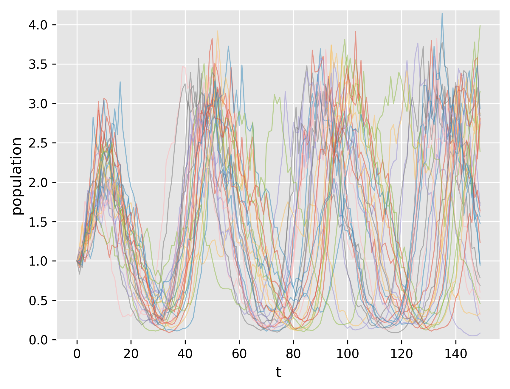

#### w=0.1
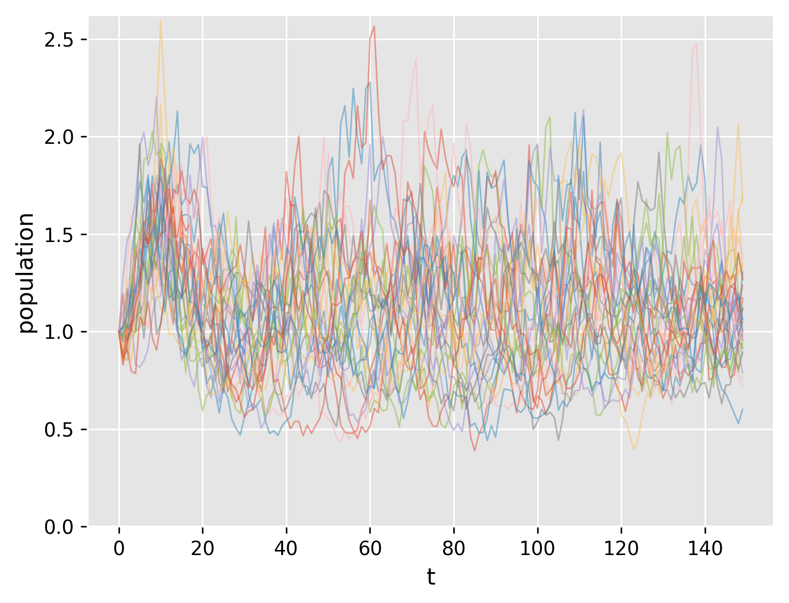

#### w=0.2

### 個体数最低値の分布

各シミュレーションにおいて、tを0から150まで動かした時に個体数が最低になった時の値をプロットした。

#### 魚種1

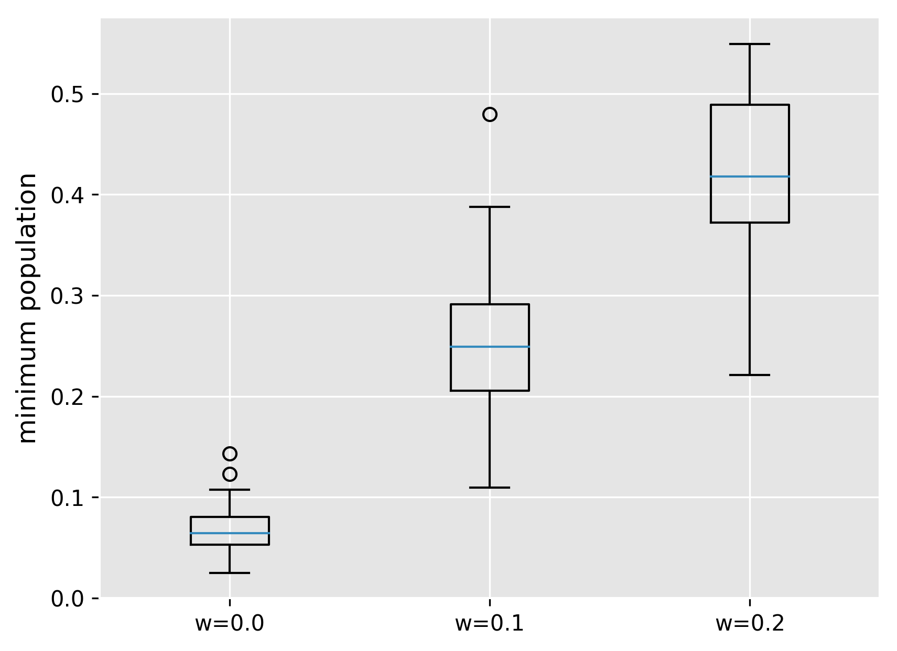

#### 魚種2

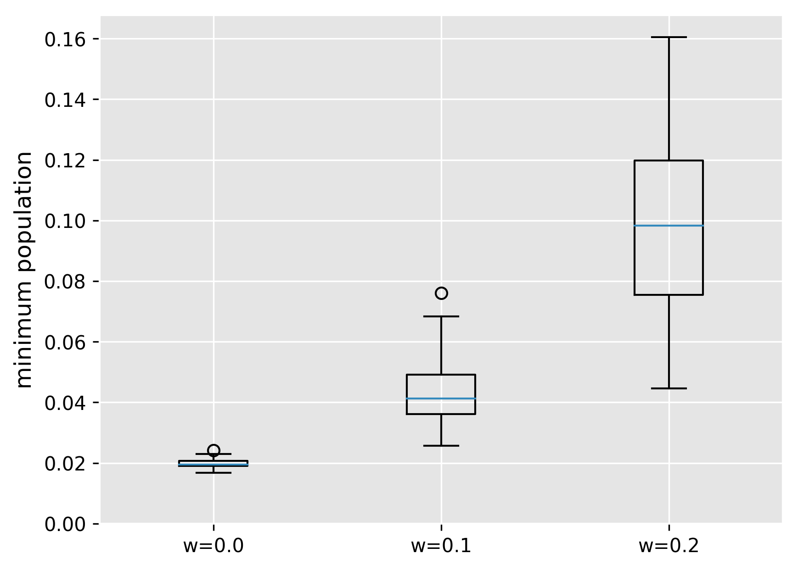

#### 魚種3

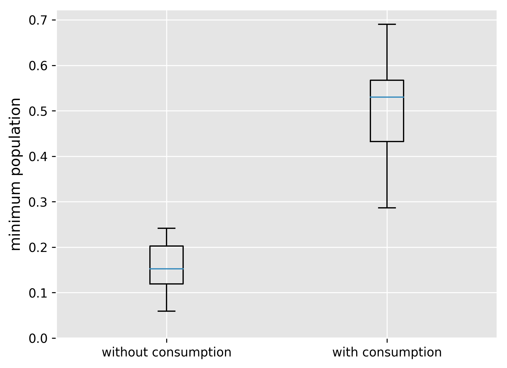

## 参考文献

[1] Hofbauer J., Hutson V., Jansen W. (1987) Coexistance for systems governed by difference equations of Lotka-Volterra type
[2] 生態学第14回 [http://minato.sip21c.org/oldlec/ecology_p14.html](http://minato.sip21c.org/oldlec/ecology_p14.html)
