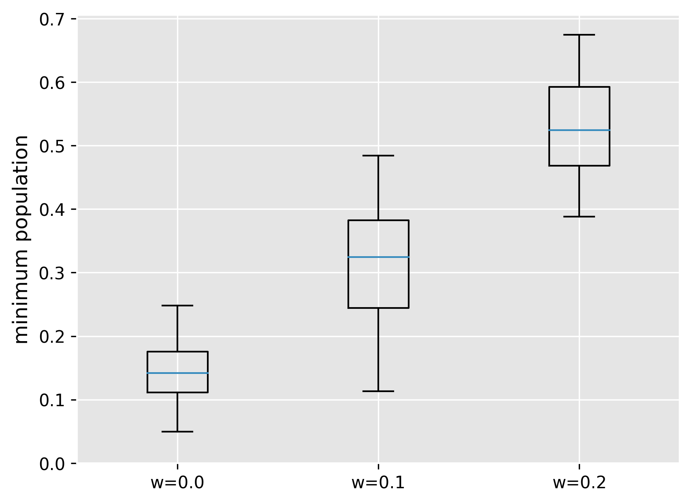

# 3すくみ仮説に基づく魚種交代シミュレーション

Lotka-Volterra方程式の変形による魚種交代のシミュレーション及び、鯨類の摂餌行動による魚種の枯渇リスクへの影響評価

## Requirements

- Python >= 3.5.0

## 実験概要

3魚種間の競合関係をモデル化するため、まずはLotka-Volterra微分方程式の解軌道の一つとして使われる以下の式を考える。

現実的には、この3種の孤立系として考えるよりも、他種からの影響を受けない場所(繁殖海域付近など)が存在する。またヒゲクジラ類の摂餌を考慮したシミュレーションを行うため、以下の仮定のもと鯨類を当該モデルに組み込む。

- ヒゲクジラ類は魚種に対しての選り好みを行わず、各魚種の個体数に比例した割合で摂餌を行う[3]
- 一般に、ヒゲクジラの個体数変動は食用魚種と比較して小さいため、無視できるものとする。

以上の仮定に基づき、他種の影響を受けない定常項と、鯨類の摂餌による変動項を設ける。

ただし、z(t)はホワイトノイズである。

wは鯨類による捕食圧を示す係数であり、この数値が高いほど鯨類の捕食圧が高いことを示す。

この式を用いて、tを0から150まで変化させた時の各魚種の個体数の変化を計測した。
また、鯨類の摂餌行動による影響を見るため、w=0(摂餌なし)の場合とw=0.1, 0.2(摂餌あり)の3パターンに対して、30回ずつシミュレーションを行い、結果を比較した。

## 実験結果

### 魚種1

#### w=0

#### w=0.1

#### w=0.2

### 魚種2

#### w=0

#### w=0.1

#### w=0.2

### 魚種3

#### w=0

#### w=0.1

#### w=0.2

### 個体数最低値の分布

各シミュレーションにおいて、tを0から150まで動かした時に個体数が最低になった時の値をプロットした。

#### 魚種1

#### 魚種2

#### 魚種3

## 考察

鯨類の捕食圧が低い場合、各魚種は異なるピークを持つ周期的変動を繰り返し、振動した。これは種間競合が魚種交替の一因となっている可能性を示唆している。
またこの振動によって、一部の魚種では特定の周期で個体数が著しく減少し、漁業に多大な影響を及ぼすことが危惧される。
一方で、いずれの魚種においても魚種の個体数が急激に増大する時期があることが示された。一般的な漁業経済において、漁獲量が急激に増大した場合には、漁獲枠超過によるさらに厳しい漁獲制限、生魚販売価格の値崩れによる操業停止など様々な問題を引き起こすことが知られている[5]。

鯨類による捕食圧をモデルに組み込んだ場合、これらの変動が大幅に抑制されることが示された。
また、周期的変動による魚種の一次的枯渇も防止され、安定した漁獲活動の実現が可能になることが示唆された。
また、変動幅が抑えられたことによって魚種の個体数の急激な増大も起こらなくなり、従って値崩れなどの問題は回避されると考えられる。

今回提案したモデルにおいては、魚種よりも下位の栄養段階に位置する動物プランクトンなどの生物は考慮に入れていない。
しかしながら、近年の漁獲圧の増加によってこれらの生物は余剰資源が生じていると考えられている。
また、これらの生物を被食-捕食モデルとして組み込んだ場合においても、魚種間での競合により総合的な捕食圧は安定していると考えられる。
そのため、栄養段階が低次の生物を組み込んだ場合においても、鯨類の捕食圧が魚種交替を抑制するという結果が生じると予想される。

一方で、このモデルは生物間相互作用のみを考慮に入れた閉鎖系モデルであり、生物と環境の間によりもたらされる相互作用は考慮に入れていない。
現在、気候変動に伴う環境変動が魚種交替にもたらす影響のメカニズムは解明されず、実際には様々な経路で作用しあっているため正確なモデリングが難しいとされている。
高須賀 (2009)[6]は生活水温が初期生活史における成長速度に直接影響を及ぼすとして、環境水温の変動により魚種交替が引き起こされるというOptimal growth temperature仮説を提案している。
彼は魚種間での産卵水温特性と過去の資源変動を比較した結果、これらが密接な関係にあることを示している。
今後は、環境との相互作用によりもたらされる魚類資源の変動にも注目し、マクロな視点に基づく資源変動モデルの開発と、鯨類の捕食圧がもたらす影響の詳細な分析が求められる。

## 参考文献

[1] Hofbauer J., Hutson V., Jansen W. (1987) Coexistance for systems governed by difference equations of Lotka-Volterra type

[2] 生態学第14回 [http://minato.sip21c.org/oldlec/ecology_p14.html](http://minato.sip21c.org/oldlec/ecology_p14.html)

[3] 田村力 (1998) 北西北太平洋および南極海におけるミンククジラ Balaenoptera acutorostrataの摂餌生態に関する研究. doi:10.11501/3137194

[4] 中島大介 (2011) 魚種交替の「３すくみ関係」. 2010年度 卒業研究レポート, 明治大学

[5] 国際技術開発センター(2010) [サンマが豊漁で貧乏！？](http://www.itdc-patent.com/topix_news/2004_8_31.htm). Accessed on Feb 9, 2018.

[6] 高須賀 明 (2009) 小型浮魚類の初期生態と魚種交替過程に関する研究. 日本水産学会誌 75(4), 640-643
